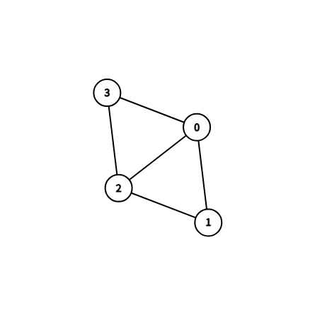

# 弗勒里 (Fleury) 算法：求欧拉回路/欧拉迹

## 算法简介

**Fleury 算法**通过逐步选边来构造欧拉回路/迹。核心原则：**优先选非割边**。

## 算法流程

1. 从起点（奇度顶点或任意顶点）出发
2. 对当前顶点 $u$：
   - 检查 $u$ 的每条关联边
   - 若该边不是割边 → 选择它
   - 若无可选的非割边 → 选择割边
   - **"不要走回头路"**（除非别无选择）
3. 删除选中的边，移动到另一端点
4. 重复 2-3 直到无边可走
5. 走过的路径即为欧拉回路/迹

## 为什么优先选非割边？

如果选了割边，剩余图会断开，导致无法遍历所有边！

## 手动模拟示例

### 图结构

边: (0,1)(0,2)(0,3)(1,2)(2,3)，度: 0=3, 1=2, 2=3, 3=2

起点=0（奇度）。

### 模拟过程

| 步骤 | 当前位置 | 候选边 | 割边? | 选择 |
|------|---------|--------|-------|------|
| 1 | 0 | (0,1) | 否 | 0→1 |
| 2 | 1 | (1,2) | 否 | 1→2 |
| 3 | 2 | (2,0) | 否（删除后0-3-2仍连通） | 2→0 |
| 4 | 0 | (0,3) | 否 | 0→3 |
| 5 | 3 | (3,2) | 只剩这条 | 3→2 |

**结果**：路径 = [0, 1, 2, 0, 3, 2]

> **注**：第 3 步中，(2,0) 删除后剩余边 (0,3) 和 (2,3)，顶点 0、2、3 仍通过 0—3—2 连通，因此 (2,0) 不是割边，可以安全选择。

## 时间复杂度

- 每步需判断边是否为割边（DFS 检查）：$O(E)$
- 共 $E$ 步：$O(E^2)$
- 注：Hierholzer 算法 $O(E)$ 更高效

## 测试用例

1. 正方形 C4：回路，长度=5
2. 三角形 K3：回路，长度=4
3. 路径：迹，长度=4
4. 正方形+对角线：迹，长度=6
