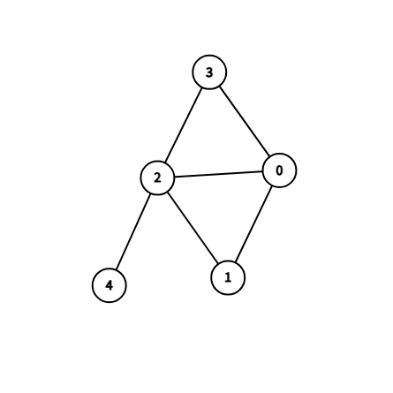

# DFSBlk：Tarjan 算法找块

## 算法简介

**块（Block / 双连通分量）**：极大 2-连通子图。割边（桥）自身也构成一个块。

**关键性质**：
- 两个块之间最多共享一个顶点（该顶点必为割点）
- 割点属于多个块，非割点只属于一个块

## 算法流程

1. 对图做 DFS，用栈维护当前路径上的边
2. 进入节点 $u$ 时，记录 dfn 和 low
3. 对于每条树边 $(u,v)$：
   - 将 $(u,v)$ 入栈
   - 递归访问 $v$
   - 若 $low[v] \ge dfn[u]$：从栈中弹出直到 $(u,v)$ 的所有边，这些边构成一个块
4. 对于后向边 $(u,v)$（$dfn[v] < dfn[u]$）：
   - 将 $(u,v)$ 入栈
   - 更新 $low[u] = \min(low[u], dfn[v])$

## 手动模拟示例

### 蝴蝶图（两个三角形共享顶点 2）

### DFS 过程（从 0 出发，邻接表顺序: 1, 2, 3, ...）

| 步骤 | 动作 | dfn | low | 栈 | 产生块? |
|------|------|-----|-----|-----|---------|
| 1 | 进入 0 | 1 | 1 | [] | |
| 2 | 0→1 入栈(树边) | | | [(0,1)] | |
| 3 | 进入 1 | 2 | 2 | [(0,1)] | |
| 4 | 1→2 入栈(树边) | | | [(0,1),(1,2)] | |
| 5 | 进入 2 | 3 | 3 | [(0,1),(1,2)] | |
| 6 | 2→0 入栈(后向边) | | low[2]=1 | [(0,1),(1,2),(2,0)] | |
| 7 | 2→3 入栈(树边) | | | [...,(2,0),(2,3)] | |
| 8 | 进入 3 | 4 | 4 | [...,(2,3)] | |
| 9 | 3→2(父)跳过 | | | | |
| 10 | 3→0 入栈(后向边) | | low[3]=1 | [...,(2,3),(3,0)] | |
| 11 | 回溯到 3 | | | | low[3]=1 ＜ dfn[2]=3, 不出块 |
| 12 | 2→4 入栈(树边) | | | [...,(3,0),(2,4)] | |
| 13 | 进入 4 | 5 | 5 | [...,(2,4)] | |
| 14 | 4→2(父)跳过 | | | | |
| 15 | 回溯到 4 | | | | low[4]=5 ≥ dfn[2]=3, 出块! |
| | 弹出到 (2,4) | | | [...,(3,0)] | 块1: {(2,4)} (割边) |
| 16 | 回溯到 2 | | low[2]=1 | | low[2]=1 ＜ dfn[2]=3, 不出块 |
| 17 | 回溯到 1 | | low[1]=1 | | low[1]=1 ＜ dfn[1]=2, 不出块 |
| 18 | 回溯到 0 | | | | low[0]=1 = dfn[0]=1, 出块! |
| | 弹出全部剩余 | | | [] | 块2: {(0,1),(1,2),(2,0),(2,3),(3,0)} |

**结论**：2 个块 — 块1 是割边 (2,4)，块2 是蝴蝶图主体（两个三角形 0-1-2-0 和 0-2-3-0，共享边 0-2，是 2-连通子图）。

## 时间复杂度

- DFS 一次遍历：$O(V+E)$
- 每条边进栈出栈一次

## 测试用例

1. 链（3 条割边）：3 个块
2. 三角形：1 个块
3. 蝴蝶图：2 个块
4. 正方形：1 个块
5. 正方形+对角线：1 个块（2-连通）
