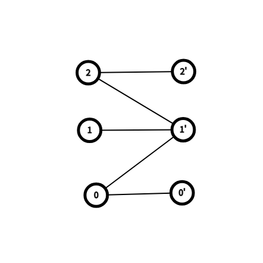

# Hopcroft-Karp 算法：二分图最大匹配

## 算法简介

**HK 算法**是匈牙利算法的改进，复杂度 $O(E\sqrt{V})$。

**核心思想**：每轮用 BFS 找出所有最短增广路，然后用 DFS 同时增广多条不相交的增广路。最多 $\sqrt{V}$ 轮。

## 算法流程

1. 初始化匹配为空
2. **BFS**：
   - 从所有未匹配的左部顶点出发
   - 在"交替图"中分层（非匹配边→匹配边→非匹配边→...）
   - 记录到达未匹配右部顶点的最短距离
3. **DFS**：
   - 对每个未匹配左部顶点，沿分层图做 DFS
   - 若找到增广路，翻转路径
   - 确保 DFS 不走回头路
4. 重复 2-3 直到 BFS 找不到增广路

## 手动模拟示例

### 二分图

L={0,1,2}, R={0,1,2}
边: 0-0, 0-1, 1-1, 2-1, 2-2

### 第 1 轮

**BFS**：
- 未匹配 L: {0,1,2}, dist={0,0,0}
- 从 L 出发到 R 的非匹配边: 0→0, 0→1, 1→1, 2→1, 2→2
- 未匹配 R: {0,1,2} → 找到！

**DFS**：
- DFS(0): 0→0, R[0]未匹配 → 匹配 (0,0)
- DFS(1): 1→1, R[1]未匹配 → 匹配 (1,1)
- DFS(2): 2→1, 但 R[1]已匹配给1, 尝试找增广路...
  - 1在分层图中, 尝试1的其他邻居: 只有1
  - 无法继续

**第 1 轮结束**：匹配数=2

### 第 2 轮

**BFS**：
- 未匹配 L: {2}, dist={INF, INF, 0}
- 2→1, R[1]匹配给1, dist[1]=1
- 从1出发, 1→1(已访问), 无其他非匹配边
- 2→2, R[2]未匹配 → 找到！

**DFS**：
- DFS(2): 2→2, 未匹配 → 匹配 (2,2)

**第 2 轮结束**：匹配数=3

BFS 找不到增广路 → 算法终止。

## 时间复杂度

- 每轮 BFS+DFS：$O(E)$
- 最多 $O(\sqrt{V})$ 轮
- 总：$O(E\sqrt{V})$

## 测试用例

1. 简单二分图：匹配数=3
2. K5,5：匹配数=5
3. 完美匹配：匹配数=3
4. 10×10 稀疏图：验证匹配数 ≤ L
